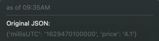

# comEd hourly pricing indicator
Plugin for swiftbar the shows the current 5 min price per kWh using [comEd APIs](https://hourlypricing.comed.com/hp-api/).

Price includes a SF Symbol indicator that will change colors depending on the price:
* green when `< 5` 
* orange when between `5`  and `10`
* red when `>10`

